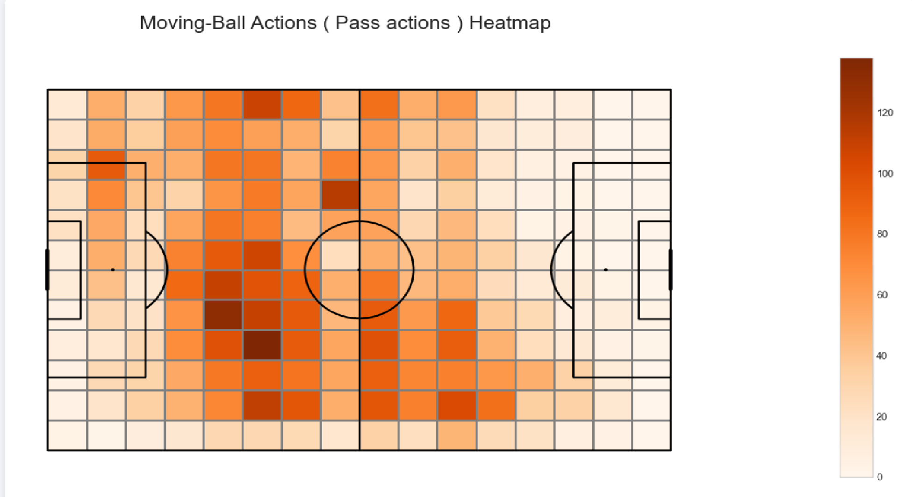
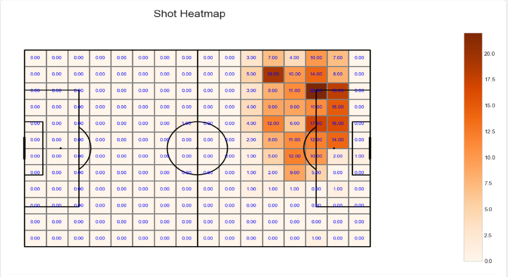
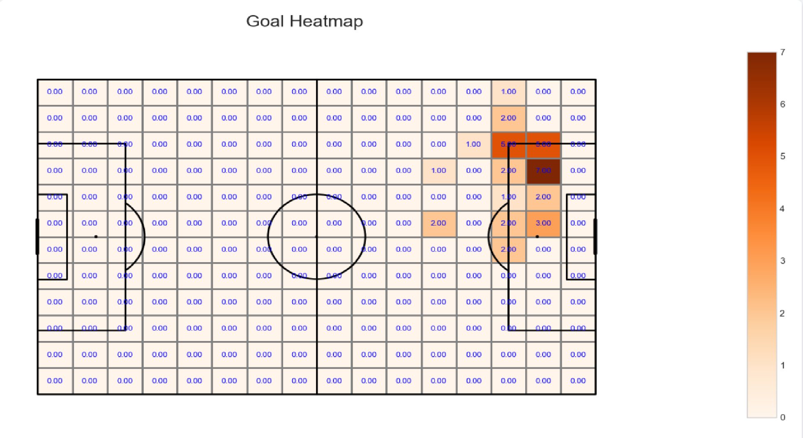

# FRF_Data_Project_ZGB

**Welcome to my FRF-DATA Project**, developed as part of the _FRF Bootcamp_ called **DATACAMP**.

## Table of Contents

1. [FRF Data Camp Concept](#frf-data-camp-concept)
2. [Context of the Idea](#context-of-the-idea)
3. [The Idea](#the-idea)
4. [Methodology](#methodology)
5. [MVP Notebook](#mvp-notebook)
6. [GUI for MVP](#gui-for-mvp)
7. [Results — All Games U Cluj](#interpretation-all-games-u-cluj)
8. [Vision for the Future](#vision-for-the-future)

## FRF Data Camp Concept

FRF IC DATA CAMP offers participants a **hands-on learning experience**. Over the course of one month, participants take part in interactive sessions working directly with real football datasets. They learn how to build data pipelines, perform analyses, identify tactical patterns, and develop meaningful visualizations for coaches, analysts, and other decision-makers in football.

The program connects participants with **local and international mentors**, currently working in analysis, scouting, and technology departments within top European organizations, federations, and clubs.

**Who is it for?**  
The camp is designed for those eager to apply data analysis concretely in football, such as:

- Students and graduates passionate about football with backgrounds in IT, mathematics, engineering, data analysis, or sports.
- Professionals with experience in data science or analytics, interested in a career in football analytics.
- Individuals familiar with football analysis and fundamental principles of data analytics.

---

### How the project should be structured

As part of the bootcamp, the projects should follow the **four key phases** defined in the program, aligned with the lessons taught during the camp. These phases also represent the typical steps of any end-to-end data solution designed to address a specific task.

<strong>Project's 4 Phases</strong>

#### 1. Business Context

Define the specific football-related problem or question to address, using open-source and publicly available data.  
This includes:

- The core problem or challenge
- Its relevance and impact within the football ecosystem
- My approach to tackling the problem
- A roadmap with key milestones and outcomes

#### 2. Data Engineering Phase

Identify and curate the most relevant datasets aligned with the project theme. Tasks include:

- Extracting data from local or cloud sources
- Cleaning, transforming, and storing it in a structured format (ex: database)
- Documenting each step of the pipeline with clear justifications

#### 3. Data Analysis Phase

Analyze the prepared data to uncover insights into the chosen problem.  
The aim is to produce **clear, actionable results** and communicate findings logically and intuitively.

#### 4. Data Visualization Phase

Refine the data and methodology, presenting the key findings through visual storytelling.  
This includes:

- Final adjustments to data and analysis
- Interactive and static visualizations
- Recommendations for immediate improvements and potential future directions

## Context of the Idea

While going through the first week of DATA CAMP, we were introduced to the world of football analytics: what it means, what is expected from different stakeholders and data users, what types of data exist, who the main providers are, which datasets are free or low-cost, and much more. For me, as a complete newcomer to this field, all this information felt like a huge wave crashing over me. At the same time, it was incredibly exciting, because I am deeply passionate about working with data and I’m committed to taking on new challenges. What makes football data even more engaging is that it’s not abstract: it’s accessible, visible, and directly connected to something tangible I interact with regularly (even if it’s just by watching matches on TV).

As I went through the auxiliary materials and the meeting videos, I found it a bit challenging to settle on a specific idea that fit my own project mantra:

- fast to ship
- valuable in impact
- clear enough to interpret
- extensible for future development

These personal criterias made choosing the main theme more difficult than expected. Still, with the guidance of the FRF IC team and the mentors, I found the motivation to keep researching and refining until I reached the right idea and managed to keep the flame alive throughout the process.

The first week felt messy with ideas. Every time something came to mind, it was either too hard to implement or already had a simple metric to showcase it. That was a little frustrating, but the grind kept going.

The second week flew by, and we were introduced to the **data engineering phase** of the project. I was still rushing without a clear theme, but now the practical challenge was right in front of me, so I knew I had to raise the bar.

One of the mentors, **Julian Sfeir**, presented some interesting plots that can be built with football data, along with the most common and widely used metrics. That pushed me to dig deeper. Suddenly I was reading about **xG, post-xG**, basically, every metric seemed to start with an “x” 😅 (just kidding). At first it was a bit confusing, but I gradually got used to their meaning, not their exact calculations yet, since I quickly realized that’s another layer of complexity.

What stood out to me was that these metrics are like **blueprints**: the concepts are clear, but the implementation can vary depending on the data provider and the analyst’s approach. That actually reassured me, because it meant I didn’t need to reinvent the wheel. Instead, I could focus on finding an angle that matched my interests and build from there.

After countless hours of searching, I decided to narrow my focus to **defense**. The attacking perspective seemed to require much deeper domain knowledge — something I couldn’t realistically catch up with in the limited time available. The defensive side, on the other hand, felt less explored (I might be wrong here, so apologies in advance to any football analytics experts who may disagree 😅). Unlike attacking patterns, there don’t seem to be as many ready-made defensive metrics, which made me even more curious to dive down this rabbit hole. Who knows — maybe this will turn out to be my “lotto ticket” for the bootcamp (sorry for the joke).

The main trigger that helped me shape my project theme was this cute metric 🙂 called **Expected Threat (xT)**. The naming might differ here and there, but the idea is consistent: it answers the question _“How dangerous is this zone in terms of leading to a goal?”_

Once I came across it, the chain of ideas started flowing, and the project theme practically wrote itself:  
**“An overview analysis of U Cluj’s defense using an xT Heatmap.”**

Sounds good, right? Let’s dive into the details of how it was developed and what it turned out to be.

## The Idea

As I mentioned earlier, the main idea of my project, more precisely the MVP, is to provide an **xT Heatmap** that highlights the zones in U Cluj’s defense most exposed to danger.

Now, you might ask: _why U Cluj, out of all the teams in Superliga?_ Fair question. The main reason is that, as participants in DATA CAMP, we were given WyScout data from last season for two teams, and one of them was U Cluj. Beyond that, U Cluj is one of the oldest and most historic clubs in the Superligaand applying a new approach, by using full-season data to extract defensive insights, could act as a spark for the team to embrace more data-informed decision-making in the future.

Since the dataset was provided by FRF, you won’t find it directly in this repo, it needs to be obtained in Excel format from WyScout. This is, of course, a limitation for the wider applicability of the project.

Even so, with limited time and only a handful of ideas, I chose to take on this challenge. While my “toys” (the Jupyter notebook and Flask GUI) may not be universally reusable without access to the same dataset, I believe the research could still prove valuable for U Cluj, if it ever reaches their hands, but also for other that might confront similar challenges as the ones I am about the describe below in the methodology.

**TL/DR (yes, I actually made one, so shush 🤫):**  
The core objective is to calculate **xT** and, along the way, highlight the other metrics and components that come together to build it.

## Methodology

Since this project is framed as an **MVP**, I decided to treat it like one. That means I didn’t focus on a detailed, step-by-step pipeline (ex: extraction → cleaning → storage → analysis). Instead, I traded that level of detail for **faster prototyping and quicker delivery** of results. According to my mantra, it’s better to have a complete prototype than an unfinished but overly-detailed mess (joking, joking 😅).

> **Note:** The methodology described below is heavily inspired by the excellent online guide from the people at _Soccermatics_. Their work has been a huge source of inspiration in football analytics, and you can read more about it here: [link](https://soccermatics.readthedocs.io/en/latest/gallery/lesson4/plot_ExpectedThreat.html).

---

### My Approach

- **Data ingestion:** I loaded the entire CSV with U Cluj event dataset (from WyScout) into a pandas DataFrame.
- **Key twist:** For this MVP, I focused only on **opponents’ passes and shots**. This expanded the analysis from just 2–4 games to **40 games** (30 from the regular season + 10 from the playoffs), giving a broader and more meaningful picture of activity zones. Of course, this approach also comes with a trade-off: it abstracts away individual opponent tactics and only highlights recurring patterns. Exactly how precise those patterns are is still open for improvement, and that’s where the enhancements I plan to propose will come in handy.
- **Adapting the guide:** I followed the Soccermatics approach but adapted the code to fit my dataset. Their guide uses JSON with fewer details, while my Excel data contained richer information, which gave me an edge, letting me pull insights more easily and even include things the guide didn’t.
- **Extra features:** After plotting the “ingredients” needed for the xT heatmap, I also added a feature suggested by the guide: calculating **xT and xT-adjusted values per opponent player**. This made it possible to see which players created the most problems overall.
- **Code modularity:** One of the strengths of this MVP notebook is its modularity. For example, if you want to check the patterns of a specific team against U Cluj, you only need to change a **single line of code** (clearly explained in the notebook).
- **GUI integration:** The same analysis is built into the GUI, which presents the calculations in a **fast, dynamic, choice-based interface**. Each plot comes with a general explanation, so that even without an analyst present, coaches and players can easily understand where the team is most vulnerable or exposed.

---

In short, this approach makes the research both **practically useful for U Cluj** and **documented well enough for others to be inspired by** — just like I was inspired by the Soccermatics guide. Many thanks to them, they’re doing amazing work!

## MVP's Notebook — Short Walkthrough

_(For the full story, challenges, and code, please follow the [notebook](./sourcecode/mvp_step_by_step.ipynb) step by step.)_

> **Origin:** The approach is inspired by the excellent _Soccermatics_ guide on xT. I adapted their ideas to my dataset and goals.  
> Read more: https://soccermatics.readthedocs.io/en/latest/gallery/lesson4/plot_ExpectedThreat.html

> **PS:** The summary was originally written by me and later polished with the help of my AI buddy. The ideas are all mine — the AI just helped me clean up the wording. So please don’t bully me for it 😅.

### What I actually did

- **Grounding in xT:** First, I played around to understand why **Markov chains** are the backbone of xT.
- **Setup:** Imported all needed libraries (plus a few extras used for edge cases along the way).
- **Focus switch (key twist):** Filtered the dataset to **opponents’ events only** (passes + shots).  
  This turns 2–4 matches into **~40 games** (regular season + playoffs) for a broader pattern view.  
  _This filter is the single-line switch you can change per team._
- **Quick helpers:** Built a tiny lookup so you can quickly find team codes of interest. You’re welcome 🙂
- **Pitch grid:** Used a **16×12 grid** to follow the guide’s sizing (robust + reusable).

### Mapping the ingredients

- **Moving-ball actions:** Mapped starting zones for **common pass types** (progressive, forward, lateral, back, crosses, etc.).  
  I also included **dribbles**—not in the original guide, but present in my data.
- **Shot map:** Filtered **shot** events and mapped their frequency on the pitch grid.
- **Goal map:** From shots that became **goals**, built a goal-frequency map.

### From counts to probabilities

- Converted all three maps to **probabilities**:
  - moving-ball & shots → share of total moves (passes + shots),
  - goals → **conversion probability** (_P(goal | shot)_).

### Transition matrix (xT’s backbone)

- Built the **transition matrix**, which represents the probabilities of moving the ball from one zone to another.
  > **Fact:** this matrix answers the question: _“If the ball starts in this zone, where is it most likely to end up next?”_
- The matrix is **dynamic**: the starting sector can be changed with just a single line of code.(see the [notebook](./sourcecode/mvp_step_by_step.ipynb))

### xT over N moves (Markov iterations)

- Computed the **xT heatmap over N moves**, showing how threat spreads across the field with successive actions (passes or shots) driven by those probabilities.
- With ~40 matches of events, these patterns are less likely to be pure noise; they reflect **general opponent tendencies** (abstracted from specific game plans).

### Bonus: player-level attribution

- Added **xT and xT-adjusted** attribution per **opponent player** to see who created the most danger against U Cluj (high level here; not deeply documented—meant as a resource for others to build on).

---

**TL/DR (yep, here we go again 😅):**  
I adapted the Soccermatics xT approach to WyScout data, focusing on **opponents’ actions**.  
Frequencies were turned into probabilities, the **transition matrix** was built, and a **Markov chain** was iterated to produce the **xT heatmaps** + plus a bonus player-level danger view.

## GUI for MVP

To make the MVP more practical, I wrapped the whole workflow in a small **Flask application**.  
The idea was simple: instead of running cells in a notebook, you can interact with the results directly in a browser.

- The **initial page** is lightweight: it has a title (_UCLUJ Team Analytics Dashboard_), a dropdown to choose the team/all games, and a **Run Analysis** button.
- Once analysis runs, you can explore different **plot options** (moving-ball actions, shot maps, goal maps, probabilities, and the xT heatmap). Each plot is paired with a short explanation to guide interpretation.
- A special feature is the **Transition Matrix**, where you can dynamically select a zone/sector on the pitch and instantly see how the ball is most likely to move from there. This makes the xT logic more interactive and easier to understand.

In short: the Flask GUI takes the notebook’s heavy lifting and makes it accessible in a **fast, dynamic, and choice-based interface**, so even coaches or staff without coding background can explore U Cluj’s defensive flaws.

## Results

After hard battle and back and forth, here are the results of my desired mvp for the entire season.

I am gonna start in this order: moving-ball heatmap, shot heatmap, goial heatmap, than explain the xT heatmap, since from my perspective these 4 areas are the most explicatory ones for me.

Yeah, the transition matrix also showcase a lot of insights but for now I am gonna focus strict on simpler explanation based on what i observe and what i read about matches overall.

> PS: the screenshots are taken from GUI interface since they are the most polished one, compared to the ones from the notebook . Thanks for understanding

### Opponent Moving-Ball Actions — Starting Zones (All Passes & Dribbles)

<strong>Click to expand analysis</strong>

- This heatmap shows the **starting zones** of all passes and dribbles made by opponent teams against U Cluj, across **40 games from last season**.
- The **color intensity** represents how often a moving-ball action began from a given location: darker = more frequent starts.
- The majority of starting actions come from the **opponent’s half**, suggesting a general tactic: opponents “bait” U Cluj by circulating the ball deep, simulating pressure and dominance in front of our front and midfield lines, drawing our defenders higher up.
- Once play progresses into U Cluj’s half, the **right wing emerges as the main attacking spearhead**, with many moves launched there before switching sides to finish near the right side of the penalty box.
- The **most intense area** is concentrated around the right side of the opponent’s half, confirming it as their preferred launch zone.
- Overall, this heatmap helps the coaching staff understand **where opponents initiate their passes and dribbles**, and how these “baiting” build-ups are designed to pull U Cluj out of shape and open up space in midfield and the defensive third.

### Opponent Shot Map — Defensive Perspective

<strong>Click to expand analysis</strong>

- This heatmap shows the **locations from which opponents attempted shots** against U Cluj across all 40 games of last season.
- The **color intensity** reflects the frequency of shots per zone (the numbers inside each cell indicate the exact counts).
- The most targeted shooting area is the **right edge of the penalty box**, with a progression along the right channel and into central areas just inside or slightly outside the box. This highlights the opponent’s preference to advance on our right side before cutting inside to finish.
- An outlier is visible on the **left wing (from the opponent’s perspective, U Cluj’s right side)**, where **19 shots** were taken. This unusually high number suggests that many of these attempts likely originated from **set-pieces or fouls**, rather than open play.
  > **Note:** This aspect could be an excellent follow-up research point for anyone studying **set-piece patterns**. You can fork this repo, adapt the methodology, and propose improvements with your insights — I’d love to see contributions in that direction.
- Taken together, this shot map reinforces the earlier observation from the **Moving-Ball Heatmap**: the opponent’s **right-sided spearhead** consistently exposes U Cluj’s defensive right flank, creating opportunities that are then converted into shots from predictable high-frequency zones.  
  Whether these zones also represent the **highest threat** will be clarified in the following analysis.

<strong>Click to expand analysis</strong>

- As highlighted earlier, this **Goals Heatmap** shows the shots that were successfully converted into goals against U Cluj.
- Unsurprisingly, it reinforces the same pattern observed in the **Shot Heatmap**: the majority of goals came from the **upper right edge of the penalty box**, with a clear progression toward the **central zones inside the box**.
- Two additional outliers appear from **outside the box**. These are most likely linked to **set-pieces or second-ball situations**, which again underlines the importance of analyzing fixed phases separately for a more complete picture.
  > **Note:** A possible extension here would be to complement both the **Shot Heatmap** and **Goals Heatmap** with **xG** and **post-shot xG** metrics. Adding shot-quality indicators would provide U Cluj with a more comprehensive overview, highlighting not just where shots and goals occurred, but also the quality and likelihood of those chances being converted.

## Vision for the Future
